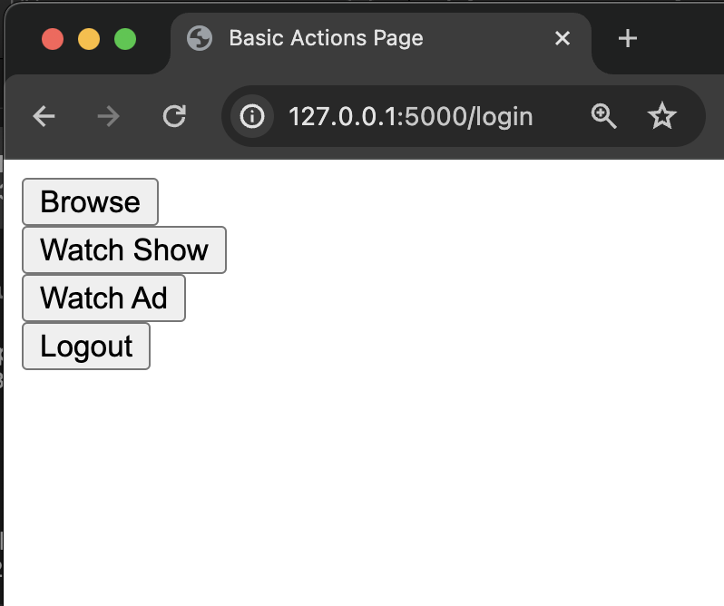
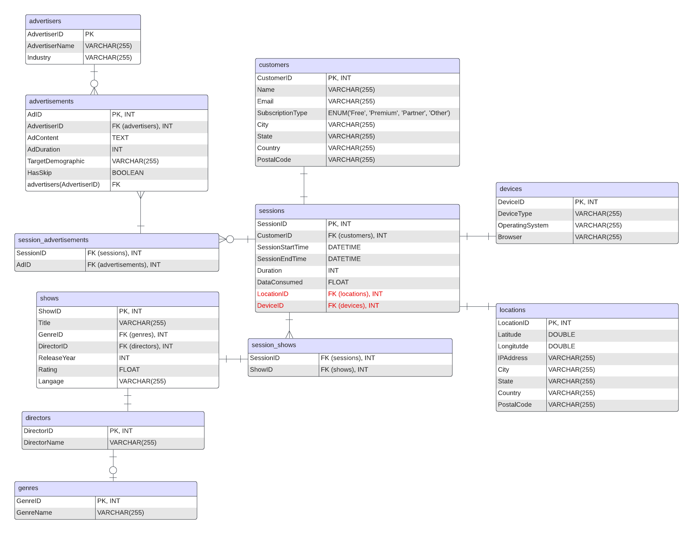

# Media Stream

A MySQL Database modeling an ad-driven streaming platform
with a skeleton of a Flask Application
which simulates app usage with some silly buttons

### Database Model

The DB Architecture is modeled in a Star / Snowflake pattern where `sessions` is the central "Fact Table" and `session_advertisements` and `session_shows` are junction tables.
